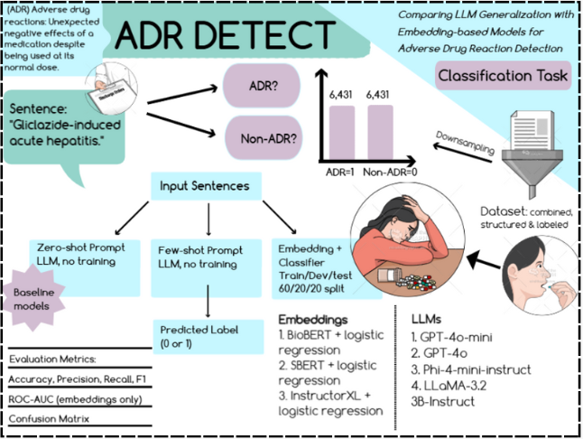

# ADR Detect: Adverse Drug Reaction Classification using LLMs and Embedding-Based Models

**Authors**: Nicole Poliak & Naveh Nissan

---

## Overview

Adverse Drug Reactions (ADRs) are a leading cause of patient harm and hospitalization, yet they are often underreported and buried within unstructured clinical or patient-generated text.  
This project investigates and compares two NLP paradigms for detecting ADRs in sentences:

- **Large Language Models (LLMs)** using Zero-/Few-shot prompting  
- **Sentence Embedding Models** combined with traditional classifiers

Our goal is to benchmark these approaches and determine which best supports scalable, automated pharmacovigilance.

---

## Task Definition

- **Input**: A single sentence from a biomedical abstract or patient review  
- **Output**: Binary label  
  - `1`: ADR present  
  - `0`: No ADR present  
- **Task**: Sentence-level binary classification (ADR vs. Non-ADR)

---

## Datasets

We used two publicly available datasets:

| Dataset        | Description                                      | Size     |
|----------------|--------------------------------------------------|----------|
| **ADE Corpus V2** | Expert-annotated PubMed sentences on drug events | 23,516   |
| **PsyTAR**     | Patient-written drug reviews from AskAPatient    | 6,009    |
| **Combined**   | Merged, cleaned, deduplicated dataset             | 26,867 → 12,862 after downsampling |

Each entry has:
- `text`: the sentence
- `label`: binary (1 = ADR, 0 = Non-ADR)
- `dataset`: source origin (ADE or PsyTAR)

> Due to class imbalance (~24% ADR), downsampling was applied to the majority class.

---

## Exploratory Data Analysis (EDA)

- **Final size after balancing**: 6,431 ADR + 6,431 Non-ADR = 12,862 total  
- **Average sentence length**: 17.2 words  
- **Duplicates removed**: 2,639  
- **Total words**: 462,108  
- **Total characters**: 2.6M+  

Text preprocessing included:
- Lowercasing  
- Punctuation removal  
- Rechecking duplicates  

---

## Modeling Approaches

### 1. Baseline Model
- **Approach**: Bag-of-Words + Naïve Bayes
- **Result**: F1 = 0.77 on test set

### 2. Embedding-Based Models
- **Embeddings**: `SBERT`, `BioBERT`, `InstructorXL`
- **Classifier**: Logistic Regression
- **Split**: Stratified 60/20/20 (train/dev/test)
- **Best Result**: BioBERT → F1 = **0.82**, ROC-AUC = **0.90**

### 3. LLMs (Zero-/Few-shot)
- **Models**: `GPT-4o`, `GPT-4o-mini`, `Phi-4-mini-instruct`, `LLaMA-3.2-3B-Instruct`
- **Prompting Strategy**:  
  - Zero-shot: no examples  
  - Few-shot: 4–8 examples  
- **Settings**: `max_tokens=5`, `temperature=0.0`, `top_p=1.0`
- **Inference Platform**: Azure OpenAI (GPTs, Phi), Hugging Face (LLaMA)

---

## Results

| Model                         | Accuracy | Precision | Recall | F1-Score
|-------------------------------|----------|-----------|--------|----------
| **BoW + Naïve Bayes**         | 0.76     | 0.73      | 0.81   | 0.77     
| **BioBERT + LR**              | 0.82     | 0.81      | 0.84   | 0.82     
| **InstructorXL + LR**         | 0.81     | 0.80      | 0.83   | 0.81     
| **GPT-4o-mini (Zero-Shot)**   | 0.84     | 0.81      | 0.89   | 0.85     
| **GPT-4o (Zero-Shot)**        | 0.83     | 0.79      | 0.90   | 0.84     
| **LLaMA-3.2 (Few-Shot)**      | 0.51     | 0.52      | 0.47   | 0.49     

> 🏆 **Highlight**: GPT-4o Zero-shot had the highest **recall (0.95)**. BioBERT achieved the strongest embedding-based performance with an AUC of **0.90**.

---

## 🔄 Full Pipeline

1. **Data Preparation**  
   Merge ADE and PsyTAR datasets, normalize schema, deduplicate, downsample

2. **EDA**  
   Analyze label distribution, sentence lengths, token statistics

3. **Baseline Modeling**  
   Bag-of-Words + Naïve Bayes

4. **Embedding Feature Extraction**  
   Generate dense vectors via InstructorXL, SBERT, BioBERT

5. **Classifier Training**  
   Logistic Regression using sentence embeddings

6. **LLM Prompting & Evaluation**  
   Zero-/few-shot testing on multiple LLMs

7. **Evaluation & Visualization**  
   Confusion matrices, ROC curves, metric comparisons

---

## Insights & Recommendations

- **LLMs** like GPT-4o achieved **top recall and F1** even without training
- **BioBERT embeddings** gave strong performance with efficient training
- **Prompt design** was key—zero-shot often outperformed few-shot
- **LLaMA** performed poorly due to lack of fine-tuning and response quality
- For clinical applications, **recall** is prioritized to avoid missing ADRs

---

## Graphical Abstract

---

## Repository Contents

| File | Description |
|------|-------------|
| `combined_dataset.csv` | Final structured dataset |
| `data_preparation.ipynb` | Dataset merging and preprocessing |
| `ADR_classification_pipeline.ipynb` | Modeling, evaluation, and results |
| `graphical_abstract.png` | Project visual summary |
| `overall_results.csv` | Aggregated results of all models |

---

## References

- [Simmering.dev Blog (2025)](https://simmering.dev/blog/modernbert-vs-llm/)
- [ACL Anthology (2025)](https://aclanthology.org/2025.insights-1.11.pdf)
- [SCITEPRESS (2025)](https://www.scitepress.org/Papers/2025/131607/131607.pdf)
- [ADE Corpus V2 on Hugging Face](https://huggingface.co/datasets/ade-benchmark-corpus/ade_corpus_v2)
- [PsyTAR Dataset Info](https://www.askapatient.com/store/#!/Psytar-Data-Set/p/449080512/category=129206256)

---

## Novelty

- Integration of **diverse data sources** (expert reports and patient reviews) into a unified dataset
- Comparison between general-purpose LLMs and biomedical embedding models

---
